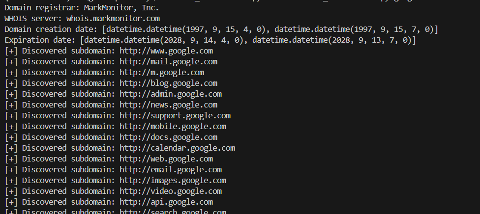

# SubDomainEnamuration
This is a command-line utility for retrieving WHOIS information and discovering subdomains associated with a specified domain using brute-forcing methode.


## Features
-WHOIS Information Retrieval: Retrieve registrar, WHOIS server, domain creation date, and expiration date for the specified domain.
-Subdomain Discovery: Scan for subdomains by attempting to access potential URLs constructed from a list of subdomains.
-Save Results: Save discovered subdomains to a text file for further analysis.


## Clone repo
```console
git clone https://github.com/your_username/domain-information-tool.git

```


## usage
```console
python subdomain_enamuration.py <target domain name>
```
### example
```console
python domain_information_tool.py example.com

```

##Output console

